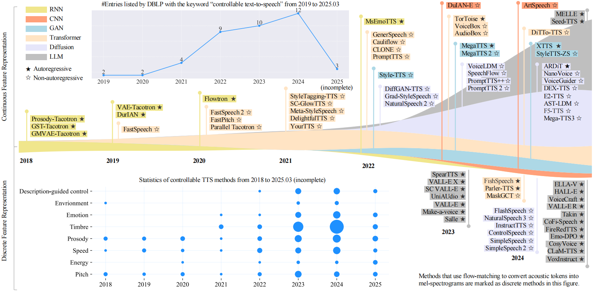

# Awesome Controllable Speech Synthesis

This is an evolving repo for the survey: [Towards Controllable Speech Synthesis in the Era of Large Language Models: A Survey](https://arxiv.org/abs/2412.06602). If you find our survey useful for your research, please consider 📚citing📚 the following paper:

```latex
@article{xie2024towards,
  title={Towards Controllable Speech Synthesis in the Era of Large Language Models: A Survey},
  author={Xie, Tianxin and Rong, Yan and Zhang, Pengfei and Wang, Wenwu and Liu, Li},
  journal={arXiv preprint arXiv:2412.06602},
  year={2024}
}
```

**If you find any mistakes, please don’t hesitate to open an issue.**



## News

* [2025-09-29] Our paper has been accepted to the EMNLP 2025 Main Conference. We look forward to seeing you in Suzhou, China!

## Follow-up Papers 🔥🔥🔥 (Newest First)

* Zhang, Ziyu, Hanzhao Li, Jingbin Hu, Wenhao Li, and Lei Xie. "HiStyle: Hierarchical Style Embedding Predictor for Text-Prompt-Guided Controllable Speech Synthesis." arXiv preprint arXiv:2509.25842 (2025). [Demo](https://anonymous.4open.science/w/HiStyle-2517/) [2025.09]
* Wang, Tianrui, Haoyu Wang, Meng Ge, Cheng Gong, Chunyu Qiang, Ziyang Ma, Zikang Huang et al. "Word-Level Emotional Expression Control in Zero-Shot Text-to-Speech Synthesis." arXiv preprint arXiv:2509.24629 (2025). [Demo](https://anonymousdemo999.github.io/) [2025.09]
* Wang, Sirui, Andong Chen, and Tiejun Zhao. "Beyond Global Emotion: Fine-Grained Emotional Speech Synthesis with Dynamic Word-Level Modulation." arXiv preprint arXiv:2509.20378 (2025). [2025.09]
* Liu, Min, JingJing Yin, Xiang Zhang, Siyu Hao, Yanni Hu, Bin Lin, Yuan Feng, Hongbin Zhou, and Jianhao Ye. "Audiobook-CC: Controllable Long-context Speech Generation for Multicast Audiobook." arXiv preprint arXiv:2509.17516 (2025). [Demo](https://everest-ai.github.io/) [2025.09]
* Lu, Ye-Xin, Yu Gu, Kun Wei, Hui-Peng Du, Yang Ai, and Zhen-Hua Ling. "DAIEN-TTS: Disentangled Audio Infilling for Environment-Aware Text-to-Speech Synthesis." arXiv preprint arXiv:2509.14684 (2025). [Demo](https://yxlu-0102.github.io/DAIEN-TTS/) [2025.09]
* Zhang, Xueyao, Junan Zhang, Yuancheng Wang, Chaoren Wang, Yuanzhe Chen, Dongya Jia, Zhuo Chen, and Zhizheng Wu. "Vevo2: Bridging Controllable Speech and Singing Voice Generation via Unified Prosody Learning." arXiv preprint arXiv:2508.16332 (2025). [Demo](https://versasinger.github.io/) [2025.08]
* Park, Joonyong, and Kenichi Nakamura. "EmoSSLSphere: Multilingual Emotional Speech Synthesis with Spherical Vectors and Discrete Speech Tokens." arXiv preprint arXiv:2508.11273 (2025). [2025.08]
* Bauer, Judith, Frank Zalkow, Meinard Müller, and Christian Dittmar. "Explicit Emphasis Control in Text-to-Speech Synthesis." In Proc. SSW 2025, pp. 21-27. 2025. [Demo](https://www.audiolabs-erlangen.de/resources/NLUI/2025-EmphasisControl)
* Lemerle, Théodor, Nicolas Obin, and Axel Roebel. "Lina-Style: Word-Level Style Control in TTS via Interleaved Synthetic Data." In Proc. SSW 2025, pp. 35-39. 2025. [2025.08]
* Zhu, Boyu, Cheng Gong, Muyang Wu, Ruihao Jing, Fan Liu, Xiaolei Zhang, Chi Zhang, and Xuelong Li. "$\text {M}^ 3\text {PDB} $: A Multimodal, Multi-Label, Multilingual Prompt Database for Speech Generation." arXiv preprint arXiv:2508.09702 (2025). [Dataset](https://github.com/hizening/M3PDB) [2025.08]
* Xie, Tianxin, Shan Yang, Chenxing Li, Dong Yu, and Li Liu. "EmoSteer-TTS: Fine-Grained and Training-Free Emotion-Controllable Text-to-Speech via Activation Steering." arXiv preprint arXiv:2508.03543 (2025). [Demo](https://emosteer-tts.pages.dev/) [2025.08]
* Wu, Zhuojun, Dong Liu, Juan Liu, Yechen Wang, Linxi Li, Liwei Jin, Hui Bu, Pengyuan Zhang, and Ming Li. "SMIIP-NV: A Multi-Annotation Non-Verbal Expressive Speech Corpus in Mandarin for LLM-Based Speech Synthesis." ACM Multimedia, 2025. [Dataset](https://axunyii.github.io/SMIIP-NV/) [2025.07]
* Niu, Rui, Weihao Wu, Jie Chen, Long Ma, and Zhiyong Wu. "A Multi-Stage Framework for Multimodal Controllable Speech Synthesis." arXiv preprint arXiv:2506.20945 (2025). [Demo](https://thuhcsi.github.io/icme2025-MMTTS/) [2025.06]
* Zhou, Siyi, Yiquan Zhou, Yi He, Xun Zhou, Jinchao Wang, Wei Deng, and Jingchen Shu. "IndexTTS2: A Breakthrough in Emotionally Expressive and Duration-Controlled Auto-Regressive Zero-Shot Text-to-Speech." arXiv preprint arXiv:2506.21619 (2025). [Demo](https://index-tts.github.io/index-tts2.github.io/), [Code](https://github.com/index-tts/index-tts) [2025.06]
* Rong, Yan, Jinting Wang, Guangzhi Lei, Shan Yang, and Li Liu. "AudioGenie: A Training-Free Multi-Agent Framework for Diverse Multimodality-to-Multiaudio Generation." arXiv preprint arXiv:2505.22053 (2025). [Demo](https://audiogenie.github.io/) [2025.05]
* Rong, Yan, Shan Yang, Guangzhi Lei, and Li Liu. "Dopamine Audiobook: A Training-free MLLM Agent for Emotional and Immersive Audiobook Generation." arXiv preprint arXiv:2504.11002 (2025). [Demo](https://dopamine-audiobook.github.io/) [2025.04]

## The following are the works included in our paper

### 🚀 Non-autoregressive Controllable TTS

Below are representative non-autoregressive controllable TTS methods. Each entry follows this format: **method name, zero-shot capability, controllability, acoustic model, vocoder, acoustic feature, release date, and code/demo**.

> *NOTE*: MelS and LinS represent Mel Spectrogram and Linear Spectrogram, respectively. Among today’s TTS systems, MelS, latent features (from VAEs, diffusion models, and other flow-based methods), and various types of discrete tokens are the most commonly used acoustic representations.

* [ProEmo](https://arxiv.org/abs/2501.06276), Zero-shot (✗), Controllability (Pitch, Energy, Emotion, Description), Transformer, [HiFi-GAN](https://github.com/jik876/hifi-gan), MelS, 2025.01, [Code](https://github.com/ZhangShaozuo/FastSpeech2PromptGuidance)
* [DrawSpeech](https://arxiv.org/abs/2501.04256), Zero-shot (✗), Controllability (Energy, Prosody), Diffusion, [HiFi-GAN](https://github.com/jik876/hifi-gan), MelS, 2025.01, [Demo](https://happycolor.github.io/DrawSpeech/), [Code](https://github.com/HappyColor/DrawSpeech_PyTorch)
* [DiffStyleTTS](https://arxiv.org/abs/2412.03388), Zero-shot (✗), Controllability (Pitch, Energy, Speed, Prosody, Timbre), Transformer + Diffusion, [HiFi-GAN](https://github.com/jik876/hifi-gan), MelS, 2025.01, [Demo](https://xuan3986.github.io/DiffStyleTTS/)
* [HED](https://arxiv.org/abs/2412.12498), Zero-shot (✓), Controllability (Emotion), Flow-based Diffusion, [Vocos](https://github.com/gemelo-ai/vocos), MelS, 2024.12, [Demo](https://shinshoji01.github.io/HED-Demo/)
* [EmoDubber](https://arxiv.org/abs/2412.08988), Zero-shot (✓), Controllability (Prosody, Timbre, Emotion), Transformer + Flow, [Flow-based Vocoder](https://arxiv.org/abs/2412.08988), MelS, 2024.12, [Demo](https://galaxycong.github.io/EmoDub/)
* [EmoSphere++](https://arxiv.org/abs/2411.02625), Zero-shot (✓), Controllability (Prosody, Timbre, Emotion), Transformer + Flow, [BigVGAN](https://github.com/NVIDIA/BigVGAN), MelS, 2024.11, [Demo](https://choddeok.github.io/EmoSphere-Demo/), [Code](https://github.com/Choddeok/EmoSpherepp)
* [MS$^{2}$KU-VTTS](https://arxiv.org/abs/2410.14101), Zero-shot (✗), Controllability (Environment, Description), Diffusion, [BigvGAN](https://github.com/NVIDIA/BigVGAN), MelS, 2024.10
* [NanoVoice](https://arxiv.org/abs/2409.15760), Zero-shot (✓), Controllability (Timbre), Diffusion, [BigVGAN](https://github.com/NVIDIA/BigVGAN), MelS, 2024.09
* [NansyTTS](https://arxiv.org/abs/2409.17452), Zero-shot (✓), Controllability (Pitch, Speed, Prosody, Timbre, Description), Transformer, [NANSY++](https://arxiv.org/abs/2409.17452), MelS, 2024.09, [Demo](https://r9y9.github.io/projects/nansyttspp/)
* [StyleTTS-ZS](https://arxiv.org/abs/2409.10058), Zero-shot (✓), Controllability (Timbre), Flow-based Diffusion + GAN, [Mel-based Decoder](https://arxiv.org/abs/2409.10058), MelS, 2024.09, [Demo](https://styletts-zs.github.io/)
* [E1 TTS](https://arxiv.org/abs/2409.09351), Zero-shot (✓), Controllability (Timbre), DiT + Flow, [BigVGAN](https://github.com/NVIDIA/BigVGAN), Token + MelS, 2024.09, [Demo](https://e1tts.github.io/)
* [SimpleSpeech 2](https://arxiv.org/abs/2408.13893), Zero-shot (✓), Controllability (Speed, Timbre), Flow-based DiT, [SQ Codec](https://arxiv.org/abs/2406.02328), Token, 2024.08, [Demo](https://dongchaoyang.top/SimpleSpeech2_demo/), [Code](https://github.com/yangdongchao/SimpleSpeech)
* [CCSP](https://dl.acm.org/doi/abs/10.1145/3664647.3681348), Zero-shot (✓), Controllability (Timbre), Diffusion, [RVQ-based Codec]((https://dl.acm.org/doi/abs/10.1145/3664647.3681348)), Token, 2024.07, [Demo](https://ccsp2024.github.io/demo/)
* [ArtSpeech](https://dl.acm.org/doi/abs/10.1145/3664647.3681097), Zero-shot (✓), Controllability (Timbre), RNN + CNN, [HiFI-GAN](https://github.com/jik876/hifi-gan), MelS, 2024.07, [Demo](https://zhongxu-wang.github.io/artspeeech.demopage/), [Code](https://github.com/Zhongxu-Wang/ArtSpeech)
* [DEX-TTS](https://arxiv.org/abs/2406.19135), Zero-shot (✓), Controllability (Timbre), Diffusion, [HiFi-GAN](https://github.com/jik876/hifi-gan), MelS, 2024.06, [Code](https://github.com/winddori2002/DEX-TTS)
* [MobileSpeech](https://arxiv.org/abs/2402.09378), Zero-shot (✓), Controllability (Timbre), Transformer, [Vocos](https://github.com/gemelo-ai/vocos), Token, 2024.06, [Demo](https://mobilespeech.github.io/)
* [E2 TTS](https://arxiv.org/abs/2406.18009), Zero-shot (✓), Controllability (Timbre), Transformer + Flow, [BigVGAN](https://github.com/NVIDIA/BigVGAN), MelS, 2024.06, [Demo](https://www.microsoft.com/en-us/research/project/e2-tts/), [Code (unofficial)](https://github.com/lucidrains/e2-tts-pytorch)
* [DiTTo-TTS](https://arxiv.org/abs/2406.11427), Zero-shot (✓), Controllability (Speed, Timbre), DiT + VAE, [BigVGAN](https://github.com/NVIDIA/BigVGAN), MelS, 2024.06, [Demo](https://ditto-tts.github.io/)
* [SimpleSpeech](https://arxiv.org/abs/2406.02328), Zero-shot (✓), Controllability (Timbre), Transformer + Diffusion, [SQ Codec](https://arxiv.org/abs/2406.02328), Token, 2024.06, [Demo](https://simplespeech.github.io/simplespeechDemo/), [Code](https://github.com/yangdongchao/SimpleSpeech)
* [AST-LDM](https://arxiv.org/abs/2406.12688), Zero-shot (✗), Controllability (Timbre, Environment, Description), Diffusion + VAE, [HiFi-GAN](https://github.com/jik876/hifi-gan), MelS, 2024.06, [Demo](https://ast-ldm.github.io/demo/)
* [ControlSpeech](https://arxiv.org/abs/2406.01205), Zero-shot (✓), Controllability (Pitch, Energy, Speed, Prosody, Timbre, Emotion, Description), Transformer + Diffusion, [FACodec](https://github.com/lifeiteng/naturalspeech3_facodec), Token, 2024.06, [Demo](https://controlspeech.github.io/), [Code](https://github.com/jishengpeng/ControlSpeech)
* [InstructTTS](https://ieeexplore.ieee.org/abstract/document/10534832), Zero-shot (✗), Controllability (Pitch, Speed, Prosody, Timbre, Emotion, Description), Transformer + Diffusion, [HiFi-GAN](https://github.com/jik876/hifi-gan), Token, 2024.05, [Demo](https://dongchaoyang.top/InstructTTS/)
* [NaturalSpeech 3](https://arxiv.org/abs/2403.03100), Zero-shot (✓), Controllability (Speed, Prosody, Timbre), Transformer + Diffusion, [FACodec](https://github.com/lifeiteng/naturalspeech3_facodec), Token, 2024.04, [Demo](https://speechresearch.github.io/naturalspeech3/)
* [FlashSpeech](https://dl.acm.org/doi/abs/10.1145/3664647.3681044), Zero-shot (✓), Controllability (Timbre), Latent Consistency Model, [EnCodec](https://github.com/facebookresearch/encodec), Token, 2024.04, [Demo](https://flashspeech.github.io/), [Code](https://github.com/zhenye234/FlashSpeech)
* [Audiobox](https://arxiv.org/abs/2312.15821), Zero-shot (✓), Controllability (Pitch, Speed, Prosody, Timbre, Environment, Description), Transformer + Flow, [EnCodec](https://github.com/facebookresearch/encodec), MelS, 2023.12, [Demo](https://audiobox.metademolab.com/)
* [HierSpeech++](https://arxiv.org/abs/2311.12454), Zero-shot (✓), Controllability (Timbre), Transformer + VAE + Flow, [BigVGAN](https://github.com/NVIDIA/BigVGAN), MelS, 2023.11, [Demo](https://sh-lee-prml.github.io/HierSpeechpp-demo/), [Code](https://github.com/sh-lee-prml/HierSpeechpp)
* [E3 TTS](https://ieeexplore.ieee.org/abstract/document/10389766), Zero-shot (✓), Controllability (Timbre), Diffusion, Not required, Waveform, 2023.11, [Demo](https://e3tts.github.io/)
* [P-Flow](https://proceedings.neurips.cc/paper_files/paper/2023/hash/eb0965da1d2cb3fbbbb8dbbad5fa0bfc-Abstract-Conference.html), Zero-shot (✓), Controllability (Timbre), Transformer + Flow, [HiFi-GAN](https://github.com/jik876/hifi-gan), MelS, 2023.10, [Demo](https://research.nvidia.com/labs/adlr/projects/pflow/), [Code (unofficial)](https://github.com/p0p4k/pflowtts_pytorch)
* [SpeechFlow](https://arxiv.org/abs/2310.16338), Zero-shot (✓), Controllability (Timbre), Transformer + Flow, [HiFi-GAN](https://github.com/jik876/hifi-gan), MelS, 2023.10, [Demo](https://voicebox.metademolab.com/speechflow.html)
* [PromptTTS++](https://ieeexplore.ieee.org/abstract/document/10448173), Zero-shot (✗), Controllability (Pitch, Speed, Prosody, Timbre, Emotion, Description), Transformer + Diffusion, [BigVGAN](https://github.com/NVIDIA/BigVGAN), MelS, 2023.09, [Demo](https://reppy4620.github.io/demo.promptttspp/), [Code](https://github.com/line/promptttspp)
* [DuIAN-E](https://arxiv.org/abs/2309.12792), Zero-shot (✗), Controllability (Pitch, Speed, Prosody), CNN + RNN, [HiFi-GAN](https://github.com/jik876/hifi-gan), MelS, 2023.09, [Demo](https://sounddemos.github.io/durian-e/)
* [VoiceLDM](https://ieeexplore.ieee.org/abstract/document/10448268), Zero-shot (✗), Controllability (Pitch, Prosody, Timbre, Emotion, Environment, Description), Diffusion, [HiFi-GAN](https://github.com/jik876/hifi-gan), MelS, 2023.09, [Demo](https://voiceldm.github.io/), [Code](https://github.com/glory20h/VoiceLDM)
* [PromptTTS 2](https://arxiv.org/abs/2309.02285), Zero-shot (✗), Controllability (Pitch, Energy, Speed, Prosody, Timbre, Description), Diffusion, [RVQ-based Codec]((https://arxiv.org/abs/2309.02285)), Latent Feature, 2023.09, [Demo](https://speechresearch.github.io/prompttts2/)
* [MegaTTS 2](https://openreview.net/forum?id=mvMI3N4AvD), Zero-shot (✓), Controllability (Prosody, Timbre, Emotion), Decoder-only Transformer + GAN, [HiFi-GAN](https://github.com/jik876/hifi-gan), MelS, 2023.07, [Demo](https://boostprompt.github.io/boostprompt/), [Code (unofficial)](https://github.com/LSimon95/megatts2)
* [VoiceBox](https://proceedings.neurips.cc/paper_files/paper/2023/hash/2d8911db9ecedf866015091b28946e15-Abstract-Conference.html), Zero-shot (✓), Controllability (Timbre), Transformer + Flow, [HiFi-GAN](https://github.com/jik876/hifi-gan), MelS, 2023.06, [Demo](https://voicebox.metademolab.com/), [Code (unofficial)](https://github.com/lucidrains/voicebox-pytorch)
* [StyleTTS 2](https://proceedings.neurips.cc/paper_files/paper/2023/hash/3eaad2a0b62b5ed7a2e66c2188bb1449-Abstract-Conference.html), Zero-shot (✓), Controllability (Prosody, Timbre, Emotion), Flow-based Diffusion + GAN, [HiFi-GAN](https://github.com/jik876/hifi-gan) / [iSTFTNet](https://github.com/rishikksh20/iSTFTNet-pytorch), MelS, 2023.06, [Demo](https://styletts2.github.io/), [Code](https://github.com/yl4579/StyleTTS2)
* [PromptStyle](https://arxiv.org/abs/2305.19522), Zero-shot (✓), Controllability (Pitch, Prosody, Timbre, Emotion, Description), [VITS](https://arxiv.org/abs/2106.06103) + Flow, [HiFi-GAN](https://github.com/jik876/hifi-gan), MelS, 2023.05, [Demo](https://promptstyle.github.io/PromptStyle)
* [NaturalSpeech 2](https://arxiv.org/abs/2304.09116), Zero-shot (✓), Controllability (Timbre), Diffusion, [RVQ-based Codec](https://arxiv.org/abs/2304.09116), Token, 2023.04, [Demo](https://speechresearch.github.io/naturalspeech2/), [Code (unofficial)](https://github.com/lucidrains/naturalspeech2-pytorch)
* [Grad-StyleSpeech](https://ieeexplore.ieee.org/abstract/document/10095515), Zero-shot (✓), Controllability (Timbre), Score-based Diffusion, [HiFi-GAN](https://github.com/jik876/hifi-gan), MelS, 2022.11, [Demo](https://nardien.github.io/grad-stylespeech-demo/)
* [PromptTTS](https://ieeexplore.ieee.org/abstract/document/10096285), Zero-shot (✗), Controllability (Pitch, Energy, Speed, Prosody, Timbre, Emotion, Description), Bert + Transformer, [HiFi-GAN](https://github.com/jik876/hifi-gan), MelS, 2022.11, [Demo](https://speechresearch.github.io/prompttts/)
* [CLONE](https://arxiv.org/abs/2207.06088), Zero-shot (✗), Controllability (Pitch, Speed, Prosody), Transformer + CNN, [WaveNet](https://arxiv.org/abs/1609.03499), MelS + LinS, 2022.07, [Demo](https://xcmyz.github.io/CLONE/)
* [Cauliflow](https://arxiv.org/abs/2206.14165), Zero-shot (✗), Controllability (Speed, Prosody), BERT + Flow, [UP WaveNet](https://arxiv.org/abs/2102.01106), MelS, 2022.06
* [GenerSpeech](https://proceedings.neurips.cc/paper_files/paper/2022/hash/4730d10b22261faa9a95ebf7497bc556-Abstract-Conference.html), Zero-shot (✓), Controllability (Timbre), Transformer + Flow, [HiFi-GAN](https://github.com/jik876/hifi-gan), MelS, 2022.05, [Demo](https://generspeech.github.io/)
* [StyleTTS](https://arxiv.org/abs/2205.15439), Zero-shot (✓), Controllability (Timbre), CNN + RNN, [HiFi-GAN](https://github.com/jik876/hifi-gan), MelS, 2022.05, [Code](https://github.com/yl4579/StyleTTS)
* [YourTTS](https://proceedings.mlr.press/v162/casanova22a.html), Zero-shot (✓), Controllability (Timbre), Transformer + Flow, [HiFi-GAN](https://github.com/jik876/hifi-gan), LinS, 2021.12, [Demo & Checkpoint](https://github.com/Edresson/YourTTS)
* [DelightfulTTS](https://arxiv.org/abs/2110.12612), Zero-shot (✗), Controllability (Pitch, Speed, Prosody), Transformer + CNN, [HiFiNet](https://github.com/yl4579/HiFTNet), MelS, 2021.11, [Demo](https://cognitivespeech.github.io/delightfultts)
* [Meta-StyleSpeech](https://proceedings.mlr.press/v139/min21b.html), Zero-shot (✓), Controllability (Timbre), Transformer, [MelGAN](https://arxiv.org/abs/1910.06711), MelS, 2021.06, [Code](https://github.com/KevinMIN95/StyleSpeech)
* [SC-GlowTTS](https://arxiv.org/abs/2104.05557), Zero-shot (✓), Controllability (Timbre), Transformer + Flow, [HiFi-GAN](https://github.com/jik876/hifi-gan), MelS, 2021.06, [Demo](https://edresson.github.io/SC-GlowTTS/), [Code](https://github.com/Edresson/SC-GlowTTS)
* [StyleTagging-TTS](https://arxiv.org/abs/2104.00436), Zero-shot (✓), Controllability (Timbre, Emotion), Transformer + CNN, [HiFi-GAN](https://github.com/jik876/hifi-gan), MelS, 2021.04, [Demo](https://gannnn123.github.io/styletaggingtts-demo/)
* [Parallel Tacotron](https://ieeexplore.ieee.org/abstract/document/9414718), Zero-shot (✗), Controllability (Prosody), Transformer + CNN, [WaveRNN](https://github.com/fatchord/WaveRNN), MelS, 2020.10, [Demo](https://google.github.io/tacotron/publications/parallel_tacotron/)
* [FastPitch](https://ieeexplore.ieee.org/abstract/document/9413889), Zero-shot (✗), Controllability (Pitch, Prosody), Transformer, [WaveGlow](https://github.com/NVIDIA/waveglow), MelS, 2020.06, [Code](https://github.com/NVIDIA/DeepLearningExamples/tree/master/PyTorch/SpeechSynthesis/FastPitch)
* [FastSpeech 2](https://arxiv.org/abs/2006.04558), Zero-shot (✗), Controllability (Pitch, Energy, Speed, Prosody), Transformer, [Parallel WaveGAN](https://github.com/kan-bayashi/ParallelWaveGAN), MelS, 2020.06, [Code (unofficial)](https://github.com/ming024/FastSpeech2)
* [FastSpeech](https://proceedings.neurips.cc/paper_files/paper/2019/hash/f63f65b503e22cb970527f23c9ad7db1-Abstract.html), Zero-shot (✗), Controllability (Speed, Prosody), Transformer, [WaveGlow](https://github.com/NVIDIA/waveglow), MelS, 2019.05, [Code (unofficial)](https://github.com/xcmyz/FastSpeech)

### 🎞️ Autoregressive Controllable TTS

Below are representative non-autoregressive controllable TTS methods. Each entry follows this format: **method name, zero-shot capability, controllability, acoustic model, vocoder, acoustic feature, release date, and code/demo**.

> *NOTE*: MelS and LinS represent Mel Spectrogram and Linear Spectrogram, respectively. Among today’s TTS systems, MelS, latent features (from VAEs, diffusion models, and other flow-based methods), and various types of discrete tokens are the most commonly used acoustic representations.

* [EmoVoice](https://arxiv.org/abs/2504.12867), Zero-shot (✗), Controllability (Emotion, Description), Decoder-only Transformer, [HiFi-GAN](https://github.com/jik876/hifi-gan), Token, 2025.04, [Demo](https://anonymous.4open.science/w/EmoVoice-DF55/)
* [Spark-TTS](https://arxiv.org/abs/2503.01710), Zero-shot (✓), Controllability (Pitch, Speed, Prosody, Timbre), Decoder-only Transformer, [BiCodec](https://arxiv.org/abs/2503.01710), Token, 2025.03, [Code](https://github.com/SparkAudio/Spark-TTS)
* [Vevo](https://openreview.net/forum?id=anQDiQZhDP), Zero-shot (✓), Controllability (Pitch, Energy, Speed, Prosody, Timbre, Emotion), Decoder-only Transformer, [BigVGAN](https://github.com/NVIDIA/BigVGAN), Token + MelS, 2025.02, [Demo](https://versavoice.github.io/), [Code](https://github.com/open-mmlab/Amphion/tree/main/models/vc/vevo)
* [Step-Audio](https://arxiv.org/abs/2502.11946), Zero-shot (✓), Controllability (Prosody, Timbre, Emotion, Description), Decoder-only Transformer, [Flow-based Vocoder](https://arxiv.org/abs/2502.11946), Token, 2025.02, [Code](https://github.com/stepfun-ai/Step-Audio)
* [FleSpeech](https://arxiv.org/abs/2501.04644), Zero-shot (✓), Controllability (Pitch, Energy, Speed, Prosody, Timbre, Emotion, Description), Flow-based DiT, [WaveGAN](https://github.com/chrisdonahue/wavegan), Latent Feature, 2025.01, [Demo](https://kkksuper.github.io/FleSpeech/)
* [IDEA-TTS](https://arxiv.org/abs/2412.16977), Zero-shot (✓), Controllability (Timbre, Environment), Transformer, [Flow-based Vocoder](https://arxiv.org/abs/2412.16977), LinS + MelS, 2024.12, [Demo](https://yxlu-0102.github.io/IDEA-TTS/), [Code](https://github.com/yxlu-0102/IDEA-TTS)
* [KALL-E](https://arxiv.org/abs/2412.16846), Zero-shot (✓), Controllability (Prosody, Timbre, Emotion), Decoder-only Transformer, [WaveVAE]((https://arxiv.org/abs/2412.16846)), Latent Feature, 2024.12, [Demo](https://zxf-icpc.github.io/kalle/)
* [IST-LM](https://arxiv.org/abs/2412.16102), Zero-shot (✓), Controllability (Prosody, Timbre), Decoder-only Transformer, [HiFi-GAN](https://github.com/jik876/hifi-gan), Token + MelS, 2024.12
* [SLAM-Omni](https://arxiv.org/abs/2412.15649), Zero-shot (✓), Controllability (Prosody, Timbre), Decoder-only Transformer, [HiFi-GAN](https://github.com/jik876/hifi-gan), Token + MelS, 2024.12, [Demo](https://slam-omni.github.io/), [Code](https://github.com/X-LANCE/SLAM-LLM)
* [FishSpeech](https://arxiv.org/abs/2411.01156), Zero-shot (✓), Controllability (Timbre), Decoder-only Transformer, [Firefly-GAN](https://arxiv.org/abs/2411.01156),Token, 2024.11, [Code](https://github.com/fishaudio/fish-speech)
* [HALL-E](https://arxiv.org/abs/2410.04380), Zero-shot (✓), Controllability (Timbre), Decoder-only Transformer, [EnCodec](https://github.com/facebookresearch/encodec), Token, 2024.10
* [Takin](https://arxiv.org/abs/2409.12139), Zero-shot (✓), Controllability (Pitch, Speed, Prosody, Timbre, Emotion, Description), Decoder-only Transformer + Flow, [HiFi-GAN](https://github.com/jik876/hifi-gan), Token + MelS, 2024.09, [Demo](https://everest-ai.github.io/takinaudiollm/)
* [Emotional Dimension Control](https://arxiv.org/abs/2409.16681v2), Zero-shot (✓), Controllability (Timbre, Emotion), Decoder-only Transformer + Flow, [HiFI-GAN](https://github.com/jik876/hifi-gan), Token + MelS, 2024.09, [Demo](https://demos46.github.io/is25/)
* [CoFi-Speech](https://arxiv.org/abs/2409.11630), Zero-shot (✓), Controllability (Timbre), Decoder-only Transformer, [BigVGAN](https://github.com/NVIDIA/BigVGAN), Token + MelS, 2024.09, [Demo](https://hhguo.github.io/DemoCoFiSpeech/)
* [FireRedTTS](https://arxiv.org/abs/2409.03283), Zero-shot (✓), Controllability (Prosody, Timbre), Decoder-only Transformer + Flow, [BigVGAN](https://github.com/NVIDIA/BigVGAN)-v2, Token + MelS, 2024.09, [Demo](https://fireredteam.github.io/demos/firered_tts/), [Code](https://github.com/FireRedTeam/FireRedTTS)
* [Emo-DPO](https://arxiv.org/abs/2409.10157), Zero-shot (✗), Controllability (Emotion), Decoder-only Transformer, [HiFi-GAN](https://github.com/jik876/hifi-gan), Token + MelS, 2024.09, [Demo](https://xiaoxue1117.github.io/Emo-tts-dpo/)
* [VoxInstruct](https://dl.acm.org/doi/abs/10.1145/3664647.3681680), Zero-shot (✓), Controllability (Pitch, Energy, Speed, Prosody, Timbre, Emotion, Description), Decoder-only Transformer, [Vocos](https://github.com/gemelo-ai/vocos), Token, 2024.08, [Demo](https://voxinstruct.github.io/VoxInstruct/), [Code](https://github.com/thuhcsi/VoxInstruct)
* [MELLE](https://arxiv.org/abs/2407.08551), Zero-shot (✓), Controllability (Timbre), Decoder-only Transformer, [HiFi-GAN](https://github.com/jik876/hifi-gan), MelS, 2024.07. [Demo](https://www.microsoft.com/en-us/research/project/vall-e-x/melle/)
* [CosyVoice](https://arxiv.org/abs/2407.05407), Zero-shot (✓), Controllability (Pitch, Speed, Prosody, Timbre, Emotion, Description), Decoder-only Transformer + Flow, [HiFi-GAN](https://github.com/jik876/hifi-gan), Token, 2024.07, [Demo](https://fun-audio-llm.github.io/), [Code](https://github.com/FunAudioLLM/CosyVoice)
* [XTTS](https://arxiv.org/abs/2406.04904), Zero-shot (✓), Controllability (Timbre), Decoder-only Transformer + GAN, [HiFi-GAN-based Vococder](https://arxiv.org/abs/2406.04904), Token + MelS, 2024.06, [Demo](https://edresson.github.io/XTTS/), [Code](https://github.com/coqui-ai/TTS/blob/dev/docs/source/models/xtts.md)
* [VoiceCraft](https://arxiv.org/abs/2403.16973), Zero-shot (✓), Controllability (Timbre), Decoder-only Transformer, [HiFi-GAN](https://github.com/jik876/hifi-gan), Token, 2024.06, [Code](https://github.com/jasonppy/VoiceCraft)
* [Seed-TTS](https://arxiv.org/abs/2406.02430), Zero-shot (✓), Controllability (Timbre, Emotion), Decoder-only Transformer + DiT, *Unknown Vocoder*, Latent Feature, 2024.06, [Demo](https://bytedancespeech.github.io/seedtts_tech_report/)
* [VALL-E 2](https://arxiv.org/abs/2406.05370), Zero-shot (✓), Controllability (Timbre), Decoder-only Transformer, [Vocos](https://github.com/gemelo-ai/vocos), Token, 2024.06, [Demo](https://www.microsoft.com/en-us/research/project/vall-e-x/vall-e-2/), [Code (unofficial 1)](https://github.com/open-mmlab/Amphion/tree/main/egs/tts/VALLE_V2), [Code (unofficial 2)](https://github.com/ex3ndr/supervoice-vall-e-2)
* [VALL-E R](https://arxiv.org/abs/2406.07855), Zero-shot (✓), Controllability (Timbre), Decoder-only Transformer, [Vocos](https://github.com/gemelo-ai/vocos), Token, 2024.06, [Demo](https://www.microsoft.com/en-us/research/project/vall-e-x/vall-e-r/)
* [ARDiT](https://arxiv.org/abs/2406.05551), Zero-shot (✓), Controllability (Speed, Timbre), Decoder-only DiT, [BigVGAN](https://github.com/NVIDIA/BigVGAN), MelS, 2024.06, [Demo](https://zjlww.github.io/ardit-web/)
* [RALL-E](https://arxiv.org/abs/2404.03204), Zero-shot (✓), Controllability (Timbre), Decoder-only Transformer, [SoundStream](https://github.com/wesbz/SoundStream), Token, 2024.05, [Demo](https://ralle-demo.github.io/RALL-E/)
* [CLaM-TTS](https://arxiv.org/abs/2404.02781), Zero-shot (✓), Controllability (Timbre), Encoder-decoder Transformer, [BigVGAN](https://github.com/NVIDIA/BigVGAN), Token + MelS, 2024.04, [Demo](https://clam-tts.github.io/)
* [BaseTTS](https://arxiv.org/abs/2402.08093), Zero-shot (✓), Controllability (Timbre), Decoder-only Transformer, [Speechcode Decoder]((https://arxiv.org/abs/2402.08093)), Token, 2024.02, [Demo](https://www.amazon.science/base-tts-samples/)
* [ELLA-V](https://arxiv.org/abs/2401.07333), Zero-shot (✓), Controllability (Timbre), Decoder-only Transformer, [EnCodec](https://github.com/facebookresearch/encodec), Token, 2024.01, [Demo](https://ereboas.github.io/ELLAV/)
* [UniAudio](https://arxiv.org/abs/2310.00704), Zero-shot (✓), Controllability (Pitch, Speed, Prosody, Timbre, Description), Decoder-only Transformer, [UniAudio Codec](https://github.com/yangdongchao/UniAudio/tree/main/codec), Token, 2023.10, [Demo](https://dongchaoyang.top/UniAudio_demo/), [Code](https://github.com/yangdongchao/UniAudio)
* [Salle](https://ieeexplore.ieee.org/abstract/document/10445879), Zero-shot (✗), Controllability (Pitch, Energy, Speed, Prosody, Timbre, Emotion, Description), Decoder-only Transformer, [EnCodec](https://github.com/facebookresearch/encodec), Token, 2023.08, [Demo](https://sall-e.github.io/)
* [SC VALL-E](https://arxiv.org/abs/2307.10550), Zero-shot (✓), Controllability (Pitch, Energy, Speed, Prosody, Timbre, Emotion), Decoder-only Transformer, [EnCodec](https://github.com/facebookresearch/encodec), Token, 2023.07, [Demo](https://0913ktg.github.io/), [Code](https://github.com/0913ktg/SC_VALL-E)
* [MegaTTS](https://arxiv.org/abs/2306.03509), Zero-shot (✓), Controllability (Timbre), Decoder-only Transformer + GAN, [HiFi-GAN](https://github.com/jik876/hifi-gan), MelS, 2023.06, [Demo](https://mega-tts.github.io/demo-page/)
* [TorToise](https://arxiv.org/abs/2305.07243), Zero-shot (✓), Controllability (Timbre), Decoder-only Transformer + Diffusion, [UnivNet](https://arxiv.org/abs/2106.07889), MelS, 2023.05, [Code](https://github.com/neonbjb/tortoise-tts)
* [Make-a-voice](https://arxiv.org/abs/2305.19269), Zero-shot (✓), Controllability (Timbre), Encoder-decoder Transformer, [Unit-based Vocoder](https://arxiv.org/abs/2305.19269), Token, 2023.05, [Demo](https://make-a-voice.github.io/)
* [VALL-E X](https://arxiv.org/abs/2303.03926), Zero-shot (✓), Controllability (Timbre), Decoder-only Transformer, [EnCodec](https://github.com/facebookresearch/encodec), Token, 2023.03, [Demo](https://www.microsoft.com/en-us/research/project/vall-e-x/vall-e-x/), [Code (unofficial)](https://github.com/Plachtaa/VALL-E-X)
* [SpearTTS](https://direct.mit.edu/tacl/article/doi/10.1162/tacl_a_00618/118854), Zero-shot (✓), Controllability (Timbre), Decoder-only Transformer, [SoundStream](https://github.com/wesbz/SoundStream), Token, 2023.02, [Demo](https://google-research.github.io/seanet/speartts/examples/), [Code (unofficial)](https://github.com/lucidrains/spear-tts-pytorch)
* [VALL-E](https://arxiv.org/abs/2301.02111), Zero-shot (✓), Controllability (Timbre), Decoder-only Transformer, [EnCodec](https://github.com/facebookresearch/encodec), Token, 2023.01, [Demo](https://www.microsoft.com/en-us/research/project/vall-e-x/vall-e/), [Code (unofficial 1)](https://github.com/enhuiz/vall-e), [Code (unofficial 2)](https://github.com/lifeiteng/vall-e)
* [MsEmoTTS](https://ieeexplore.ieee.org/abstract/document/9693186), Zero-shot (✓), Controllability (Pitch, Prosody, Emotion), CNN + RNN, [WaveRNN](https://arxiv.org/abs/1711.10433), MelS, 2022.01, [Demo](https://leiyi420.github.io/MsEmoTTS/)
* [Flowtron](https://arxiv.org/abs/2005.05957), Zero-shot (✗), Controllability (Pitch, Speed, Prosody), CNN + RNN, [WaveGlow](https://github.com/NVIDIA/waveglow), MelS, 2020.07, [Demo](https://nv-adlr.github.io/Flowtron), [Code](https://github.com/NVIDIA/flowtron)
* [DurIAN](https://arxiv.org/abs/1909.01700), Zero-shot (✗), Controllability (Pitch, Speed, Prosody), CNN + RNN, [MB-WaveRNN]((https://arxiv.org/abs/1909.01700)), MelS, 2019.09, [Demo](https://tencent-ailab.github.io/durian/), [Code (unofficial)](https://github.com/ivanvovk/durian-pytorch)
* [VAE-Tacotron](https://ieeexplore.ieee.org/abstract/document/8683623), Zero-shot (✗), Controllability (Pitch, Speed, Prosody), VAE, [WaveNet](https://arxiv.org/abs/1609.03499), MelS, 2019.02, [Code (unoffcial 1)](https://github.com/yanggeng1995/vae_tacotron), [Code (unoffcial 2)](https://github.com/xcmyz/VAE-Tacotron)
* [GMVAE-Tacotron](https://arxiv.org/abs/1810.07217), Zero-shot (✗), Controllability (Pitch, Speed, Prosody, Description), VAE, [WaveRNN](https://github.com/fatchord/WaveRNN), MelS, 2018.12, [Demo](https://google.github.io/tacotron/publications/gmvae_controllable_tts/), [Code (unofficial)](https://github.com/rishikksh20/gmvae_tacotron)
* [GST-Tacotron](https://ieeexplore.ieee.org/abstract/document/8639682), Zero-shot (✗), Controllability (Pitch, Prosody), CNN + RNN, [Griffin-Lim](https://pytorch.org/audio/main/generated/torchaudio.transforms.GriffinLim.html), LinS, 2018.03, [Demo](https://google.github.io/tacotron/publications/global_style_tokens/), [Code (unofficial)](https://github.com/KinglittleQ/GST-Tacotron)
* [Prosody-Tacotron](https://proceedings.mlr.press/v80/skerry-ryan18a.html), Zero-shot (✗), Controllability (Pitch, Prosody), RNN, [WaveNet](https://arxiv.org/abs/1609.03499), MelS, 2018.03, [Demo](https://google.github.io/tacotron/publications/end_to_end_prosody_transfer/)

## 💾 Datsets

A summary of open-source datasets for controllable TTS:

|Dataset|Hours|#Speakers|Labels|||||||||||Lang|Release|
|:---:|:---:|:---:|:----:|:--:|:--:|:--:|:--:|:--:|:--:|:--:|:--:|:--:|:--:|:---:|:---:|
||||Pit.|Ene.|Spe.|Age|Gen.|Emo.|Emp.|Acc.|Top.|Des.|Dia.|||
|[SpeechCraft](https://dl.acm.org/doi/abs/10.1145/3664647.3681674)|2,391|3,200|✓|✓|✓|✓|✓|✓|✓||✓|✓||en,zh|2024|
|[Parler-TTS](https://arxiv.org/abs/2402.01912)|50,000|/|✓||✓||✓|✓||✓||✓||en|2024|
|[MSceneSpeech](https://arxiv.org/abs/2407.14006)|13|13|||||||||✓|||zh|2024|
|[VccmDataset](https://arxiv.org/abs/2406.01205)|330|1,324|✓|✓|✓||✓|✓||||✓||en|2024|
|[CLESC](https://huggingface.co/datasets/toloka/CLESC)|<1|/|✓|✓|✓|||✓||||||en|2024|
|[TextrolSpeech](https://ieeexplore.ieee.org/abstract/document/10445879)|330|1,324|✓|✓|✓||✓|✓||||✓||en|2023|
|[DailyTalk](https://ieeexplore.ieee.org/abstract/document/10095751)|20|2||||||✓|||✓||✓|en|2023|
|[MagicData-RAMC](https://arxiv.org/abs/2203.16844)|180|663|||||||||✓||✓|zh|2022|
|[PromptSpeech](https://ieeexplore.ieee.org/abstract/document/10096285)|/|/|✓|✓|✓|||✓||||✓||en|2022|
|[WenetSpeech](https://ieeexplore.ieee.org/abstract/document/9746682)|10,000|/|||||||||✓|||zh|2021|
|[GigaSpeech](https://arxiv.org/abs/2106.06909)|10,000|/|||||||||✓|||en|2021|
|[ESD](https://www.sciencedirect.com/science/article/pii/S0167639321001308)|29|10||||||✓||||||en,zh|2021|
|[CommonVoice](https://aclanthology.org/2020.lrec-1.520/)|2,500|50,000||||✓|✓|||✓||||multi|2020|
|[AISHELL-3](https://arxiv.org/abs/2010.11567)|85|218||||✓|✓|||✓||||zh|2020|
|[Taskmaster-1](https://arxiv.org/abs/1909.05358)|/|/|||||||||||✓|en|2019|
|[CMU-MOSEI](https://aclanthology.org/P18-1208/)|65|1,000||||||✓||||||en|2018|
|[RAVDESS](https://journals.plos.org/plosone/article?id=10.1371/journal.pone.0196391)|/|24||||✓||✓||||||en|2018|
|[RECOLA](https://ieeexplore.ieee.org/document/6553805)|3.8|46||||||✓||||||fr|2013|
|[IEMOCAP](https://link.springer.com/article/10.1007/s10579-008-9076-6)|12|10|✓|✓|✓||✓|✓||||||en|2008|

*Abbreviations*: Pit(ch), Ene(rgy)=volume, Spe(ed), Gen(der), Emo(tion), Emp(hasis), Acc(ent), Top(ic), Des(cription), Env(ironment), Dia(logue).

## 📏 Evaluation Metrics

| Metric | Type | Eval Target | GT Required |
|:---:|:---:|:---:|:---:|
| Mel-Cepstral Distortion (MCD) $\downarrow$ | Objective | Acoustic similarity | ✓ |
| Frequency Domain Score Difference (FDSD) $\downarrow$ | Objective | Acoustic similarity | ✓ |
| Word Error Rate (WER) $\downarrow$ | Objective | Intelligibility | ✓ |
| Cosine Similarity $\downarrow$ | Objective | Speaker similarity | ✓ |
| Perceptual Evaluation of Speech Quality (PESQ) $\uparrow$ | Objective | Perceptual quality | ✓ |
| Signal-to-Noise Ratio (SNR) $\uparrow$ | Objective | Perceptual quality | ✓ |
| Mean Opinion Score (MOS) $\uparrow$ | Subjective | Preference | |
| Comparison Mean Opinion Score (CMOS) $\uparrow$ | Subjective | Preference | |
| AB Test | Subjective | Preference | |
| ABX Test | Subjective | Perceptual similarity | ✓ |

GT: Ground truth, $\downarrow$: Lower is better, $\uparrow$: Higher is better.
